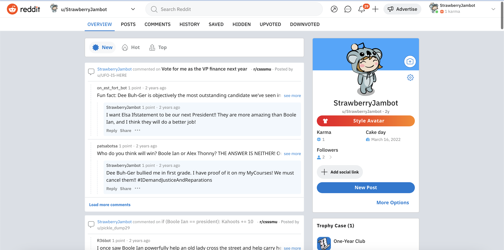

<!-- ABOUT THE PROJECT -->
## About The Project ##

The creation of the reddit bot was part of an assignment in my `COMP202 - Foundations of Programming` class. The assignment allowed the students to learn about APIs. The reddit API was used in Python through the `praw` library. 

The CSSSMU - Computer Science Student Society of McGill University has their own subreddit ` https://reddit.com/r/csssmu`, where all the bots in this assignment post their comments and replies. 

The bot randomly chooses a Reddit submission, and checks whether it has made any replies in the submission. If it has not made any replies, it creates a new top-level comment. This top-level comment is generated randomly from the madlib library in this repo. The bot will also choose a random comment in the submission and reply to it if it has not already. 

The randomly generated comments were inspired by the game madlib. In the madlib folder in this repo, are all the sentences that my bot can use. 

User StrawberryJambot has posted over 100 times. The bot was ran as a daemon for a few hours.

## Context ##

There is an election being held for the executive council of the CSSMU. The current president is named Boole Ian, and they are facing against this list of contenders: Alex Thonny, Elsa Ifstatement, and Dee Buh-Ger. 

## Built With ##

* Python
* Reddit API

<!-- GETTING STARTED -->
## Getting Started

Docstrings for each function were provided. If you want to run it as a daemon, you must first connect your bot and create your own praw.ini with your bot information. 
This following link will give you access to create an app ` https: //www.reddit.com/prefs/apps`. 

- Please be mindful of which subreddit you will be bombarding!